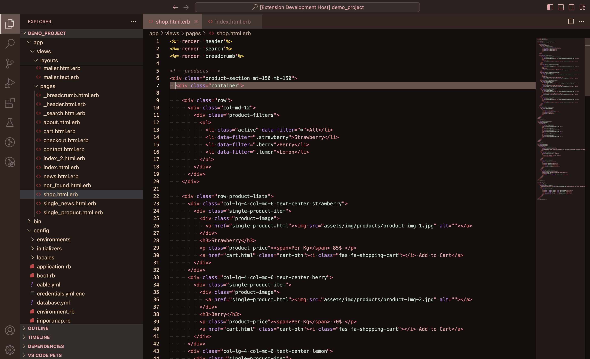
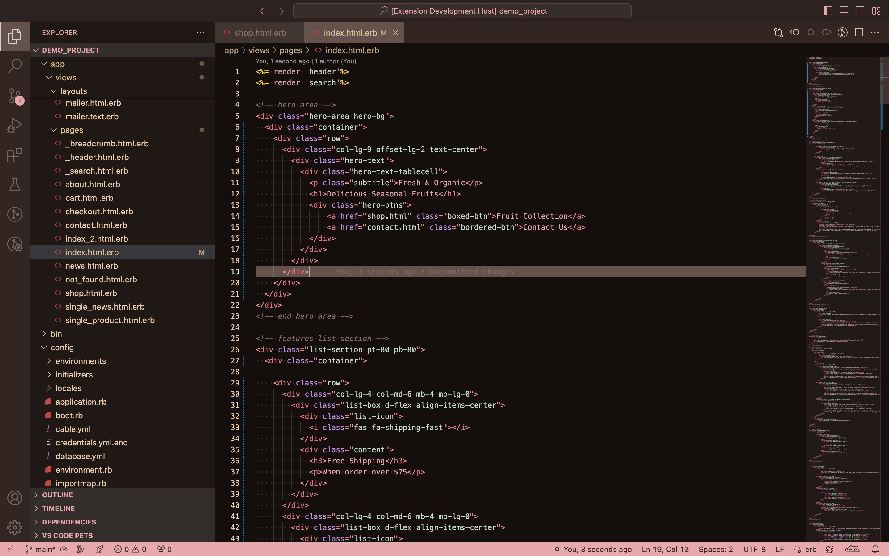
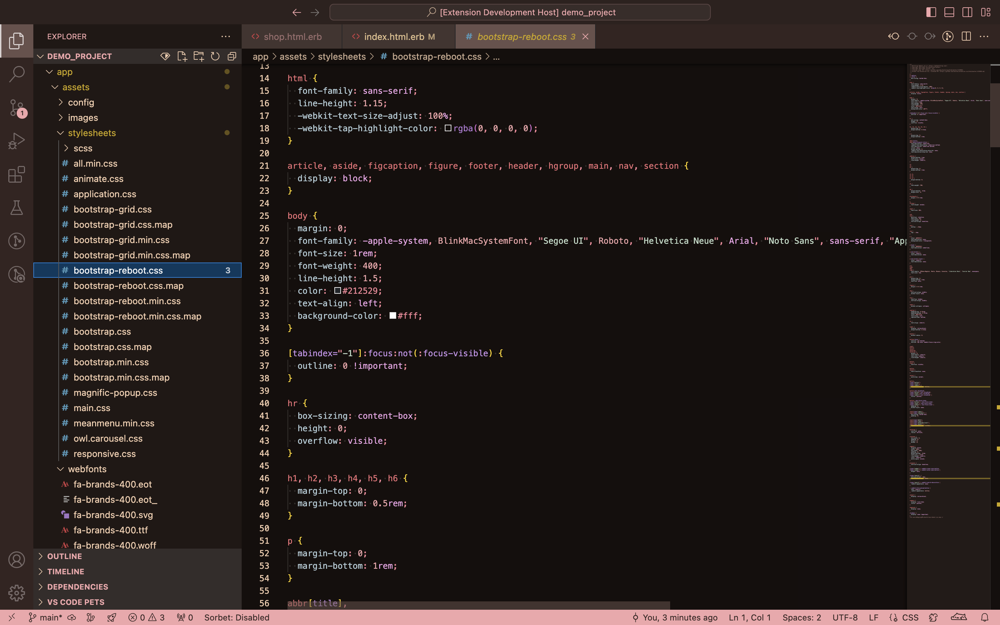
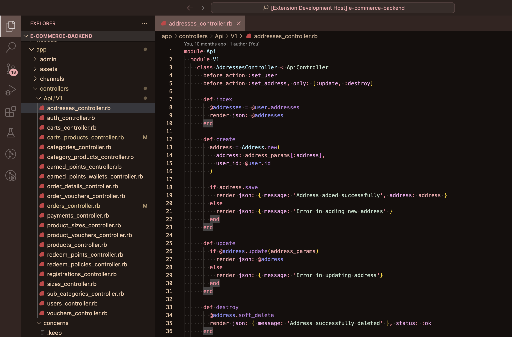
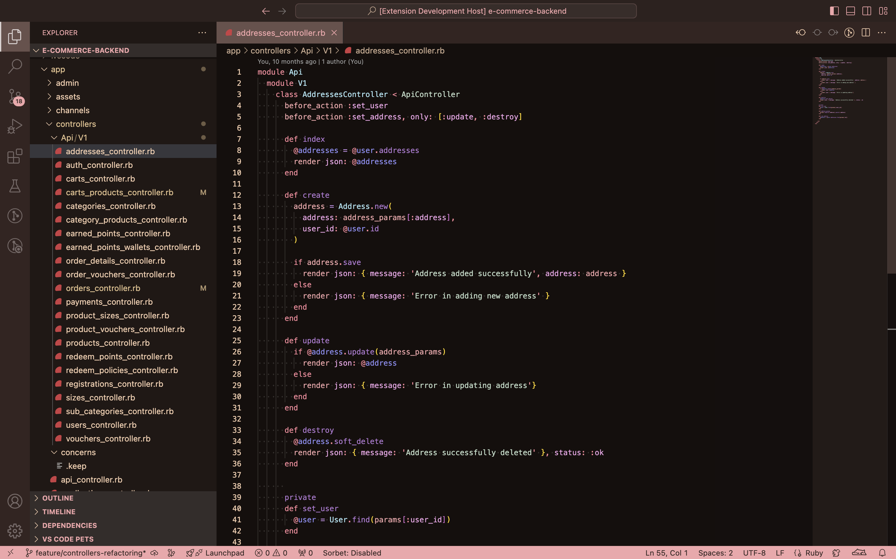

# Codepresso - A Coffee Inspired VS Code Theme
Codepresso is a warm, coffee-inspired theme for Visual Studio Code. This theme brings a cozy vibe to your workspace and helps you focus on what matters - writing great code.

## Why Codepresso?
- Smooth and balanced color palette, easy on the eyes.

## Installation
1. Open Extensions in VS Code.
2. Search for Codepresso.
3. Click Install.
4. Select it as your color theme:
    ```
    Ctrl/⌘ + Shift + P → Preferences: Color Theme → Codepresso
    ```

## Preview






